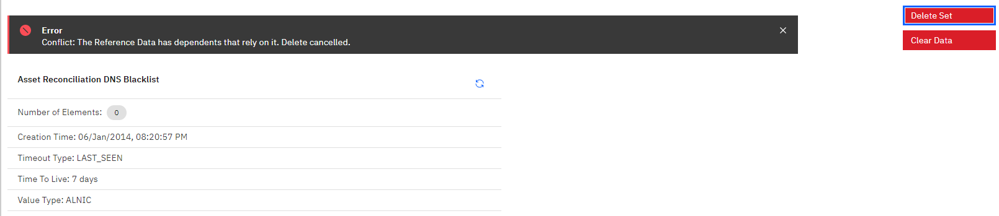

# Reference Data Management
[TOC]

The app allows the creation, deletion and visualization of all types of Reference Data in QRadar. Most supported operations on the different data types can be performed from within the app, for instance bulk insertion of new data into a Reference Map. The different data types and available operations are described below.

The view consists of two sections.
In the left side of the view, all the defined reference data entries are shown. The entries are ordered alphabetically by type (set, map, map of set, table).


## Create new data
By clicking on the `Create New` button below a reference data type, a new reference data entry of the specific type can be created:


For the different types, different kinds of data need to be specified. For instance, for a set, the `name`,`element type` are required, the `time to live` is optional and can be specified as a numeric value + an element of {mons,days,hours,minutes,seconds} from the dropdown menu.


Reference Maps and Map of Sets are created similarly. An additional detail on tables: A number of "inner keys" can be specified to define the table structure. Each inner key consists of a `name` and a `type` which can be chosen from the dropdown at the right. Inner keys cann be added via the "Add Inner Key" button and deleted via the "Trash" Icon to the right of the key.


## Display data
Clicking on one of the entries will display the contents of the specified entry.


It should be noted, that for large reference data entries, loading will be done in chunks but the data will only be displayed when all entries have been loaded. That the loading is ongoing can be verified by checking if the `number of elements`, displayed on the top of the view changes periodically.

### Reference Sets
#### Add Entry
Add a single entry to the reference set. A value must be specified. Additionally, a comment can be added which will be stored in the `source` property for the entry. This can be convenient for tracking changes.


#### Bulk Add 
Add multiple entries at the same time. A separator needs to be specified which can be used to split the entries. Additionally, a new line can be used to separate entries, as new lines will be implicitly used as separator character.

#### Import CSV
Similiarliy to the `Bulk Add` functionality, instead of pasting the contents in the bulk add text area, a file can be specified which contains the data to be added. Each entry is separated by a new line. The expected format is either
```
value1
value2
value3
```
or 
```
values,other,headers
value1,some,data
value2,other,data2
```
However, all list entries besides the first column are ignored during the upload. This is only added to be able to directly reimport data that has been exported via the app before.


#### Export CSV
The data can be exported easily into a file in CSV format where each entry is separated by a new line. CSV is allowed because it is possible to directly reimport data that has been exported via the App. Fields like `last_seen` are simply ignored by the upload function.


#### Delete Entry
One or multiple entries can be selected by clicking on them in the table. Clicking on `Delete Entry` afterwards, will attempt to delete the selected entries from the reference data.


#### Clear Data
There are two buttons on the upper right side for each Reference Data Entry.


Clicking this button will purge all data for this reference data entry. This might be helpful to get rid of all content while keeping the reference data entry existant (e.g. if it cannot be deleted due to dependencies).

#### Delete Set
If the reference data entry has no dependencies, it can be deleted by clicking `Delete Set`. Attempting to delete an reference data entry will ask for confirmation before performing any action.
Dependencies are displayed below the table with reference data contents.


### Reference Maps
Reference Maps support essentially the same operations as reference sets. 

#### Bulk Add
The expected format for bulk adding data is:
```
key,value
key2,value2
key3,value3...
```
where the separator between two entries can be specified as Key-Value-Separator
   


#### Import CSV
The expected format for importing data is:
```
key,value,optional,headers...
key1,value1,..
key2,value2,..
```
Only the two first columns are relevant for importing, the rest is ignored

### Reference Map of Sets


When opening a Reference Map of Sets, only the outer keys are displayed. The inner values for a specific outer key can be displayed by clicking the `v` at the left side of the key.

It should be noted, that searching will always search in the keys AND the values of a data entry, e.g. searching for `smss.exe` will display all keys that match this expression as well as all keys that have some value, matching this expression.


#### Bulk Add
The expected format for bulk adding data is:
```
key,value
key,valueX
key,valueY
key2,value2
key2,value2X...
```

#### Import CSV
The expected format for importing data is:
```
key,value,optional,headers...
key,value1,..
key,value2,..
```
Only the two first columns are relevant for importing, the rest is ignored


### Reference Tables
Reference Tables are a more restricted version of Map of Maps where a predefined number of key=value pairs can be specified for an outer key.


#### Bulk Add
The expected format for bulk adding data is:
```
outerkey,innerkey,value
outerkey,innerkey2,value2
outerkey,innerkey3,value3
outerkey2,innerkey,value
outerkey2,innerkey2,value2...
```

#### Import CSV
The expected format for importing data is:
```
outerkey,innerkey,value,optional,headers...
outerkey,innerkey,value
outerkey,innerkey2,value2
outerkey,innerkey3,value3
outerkey2,innerkey,value
outerkey2,innerkey2,value2...
```
Only the two first columns are relevant for importing, the rest is ignored

## Dependencies
When opening a reference data entry, a dependency check is performed. Rule and BB dependencies can be opened directly in a popup window for editing. Those dependencies can easily be identified by their blue text color:


## Named Service
The app supports accessing individual Reference Data via a named service interface.
Accessing a specific reference data entry can be achieved by calling:
`https://{qradar_url}/console/plugins/{app_id}/app_proxy/#/data/view/{type}/{name}`
a new entry can be created by calling
`https://{qradar_url}/console/plugins/{app_id}/app_proxy/#/data/create/{type}`

where `type` is one of `["sets", "maps", "tables", "map_of_sets"]`

This can be done via code by using the QRadar JS SDK doing a request similiar to this:
```
QRadar.rest({
            httpMethod: "GET",
            path: "/api/gui_app_framework/named_services",
            onComplete: function() {
                let services = JSON.parse(this.responseText);
                let service = QRadar.getNamedService(services, 'reference_data_service', 1);
                let endpoint = QRadar.getNamedServiceEndpoint(service, 'data');
                restArgs = QRadar.buildNamedServiceEndpointRestArgs({}, endpoint, {'type':'sets','name':'early_warning'});
                window.openWindow(restArgs.path)
            }
 })
```

## Additonal information and known issues

### Dates
Dates in DATE Ref Data is represented as timestamp (UNIX epoch). The same is true for 'last seen' or 'first seen' which leads to potentially surprising values like '1.54393E+12' when exported to CSV and opened in a program like MS Excel. They need to be converted to a date, which, in MS Excel may be done with a formula like 

> ```=((((A1/1000)/60)/60)/24)+DATE(1970,1,1)```

### Searching
Most search fields are regex fields, i.e. one can input a javascript regular expression that will be evaluated against the search text.


If data contains 'subdata' which is not shown in the tables directly (e.g. reference table inner key/values), this data is usually also searched for the search expression.

> Important: Only keys/values are searched. It is currently not possible to search for things like 'source', 'last seen' or 'first seen'.

### Import large files
It has been observed, that the app hangs when importing large files (e.g. Reference Sets with > 100k entries). Usually, the file is still uploaded correctly, so after a page refresh, it should be displayed as expected.

### Reference Map of Sets with sparse keys and dense values
Attempting to load a Map of Set that contains only a small number of keys but an extraordinarily large number of values for each key (e.g. 5 keys with 100k values each). Loading that data might fail. Adding data, purging data and deleting the reference data entry are still possible. There is currently no workaround available.

### Errors
Most errors are handled either silently or by displaying an error message at the top of the currently displayed screen. For instance, the below error occured when the user attempted to delete a reference set with dependents.


#### Errors after Updating the App
Some users reported duplicate tabs after updating the app from Version 2.0.0 to a newer version. This can be fixed by uninstalling both applications via the API and performing a clean reinstall.
1.) Uninstall the App via the Extension Management (Admin -> Extension Management)
2.) Find the old App ID for the other version (most easily via `docker ps` on the console or App Host)
3.) Remove the old App from QRadar (most easily via the API `DELETE /gui_app_framework/applications/{application_id}`)
4.) Do a fresh installation (most easily via the App Extension GUI)