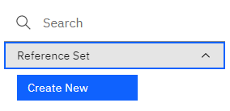
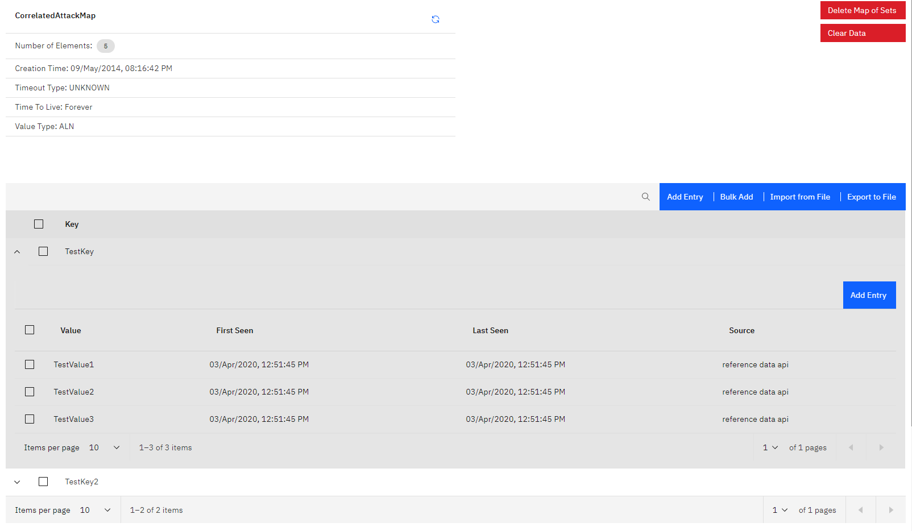
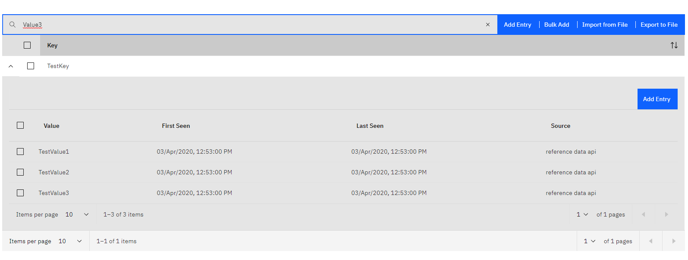

# Reference Data Management
- [Reference Data Management](#reference-data-management)
    - [Create new data](#create-new-data)
    - [Display data](#display-data)
      - [Reference Sets](#reference-sets)
        - [Add Entry](#add-entry)
        - [Bulk Add](#bulk-add)
        - [Import CSV](#import-csv)
        - [Export CSV](#export-csv)
        - [Delete Entry](#delete-entry)
        - [Clear Data](#clear-data)
        - [Delete Set](#delete-set)
      - [Reference Maps](#reference-maps)
      - [Reference Map of Sets](#reference-map-of-sets)
      - [Reference Tables](#reference-tables)
  - [Additonal information](#additonal-information)
    - [Dates](#dates)
    - [Searching](#searching)
    - [Errors](#errors)
    - [Reference Map of Sets with sparse keys and dense values](#reference-map-of-sets-with-sparse-keys-and-dense-values)

The app allows the creation, deletion and visualization of all types of Reference Data in QRadar. Most supported operations on the different data types can be performed from within the app, for instance bulk insertion of new data into a Reference Map. The different data types and available operations are described below.

The view consists of two sections.
In the left side of the view, all the defined reference data entries are shown. The entries are ordered alphabetically by type (set, map, map of set, table).


### Create new data
By clicking on the `+` next to a reference data type, a new reference data entry of the specific type can be created:




### Display data
Clicking on one of the entries will display the contents of the specified entry.


It should be noted, that for large reference data entries, loading will be done in chunks but the data will only be displayed when all entries have been loaded. That the loading is ongoing can be verified by checking if the `number of elements`, displayed on the top of the view changes periodically.

#### Reference Sets
Reference Sets and Maps support the most operations

##### Add Entry
Add a single entry to the reference set

##### Bulk Add 
Add multiple entries at the same time. A separator needs to be specified which can be used to split the entries. Additionally, a new line can be used to separate entries, as new lines will be implicitly used as separator character.

##### Import CSV
Similiarliy to the `Bulk Add` functionality, instead of pasting the contents in the bulk add text area, a file can be specified which contains the data to be added. As described above, a separator needs to be specified.

##### Export CSV
The data can be exported easily into a file in CSV format.
> Important: The exported data cannot simply be reimported to QRadar via the `import csv` function as it contains additional fields like `last seen` or `source`. Instead, the `import csv` function simply expects values separated by the specified character.

##### Delete Entry
One or multiple entries can be selected by clicking on them in the table. Clicking on `Delete Entry` afterwards, will attempt to delete the selected entries from the reference data.

##### Clear Data
Clicking this button will purge all data for this reference data entry. This might be helpful to get rid of all content while keeping the reference data entry existant (e.g. if it cannot be deleted due to dependencies).

##### Delete Set
If the reference data entry has no dependencies, it can be deleted by clicking `Delete Set`. Attempting to delete an reference data entry will ask for confirmation before performing any action.
Dependencies are displayed below the table with reference data contents.


#### Reference Maps
Reference Maps support essentially the same operations as reference sets. While bulk adding or importing entries, two separator characters need to be specified, however. 
1. The Key-Value Separator which specifies how to distinguish a key from a value (e.g. key=value => separator is `=`)
2. The Entries Separator which specifies how each key/value pair is separated from each other (e.g. key=value,key2=value2 => separator is `,`). As in reference sets, new line characters are implicit entry separators
   


#### Reference Map of Sets


Reference Map of Sets currently only support a subset of operations, i.e. 
1. Add entry: add/update a key with one or multiple values
2. Delete entry: delete one or more existing keys
3. Export CSV: Export all table data
4. Add/Delete inner value: Add or delete a 'inner' value for an existing key

When opening a Reference Map of Sets, only the outer keys are displayed. The inner values for a specific outer key can be displayed by clicking the `+` at the left side of the key.

It should be noted, that searching will always search in the keys AND the values of a data entry, e.g. searching for `smss.exe` will display all keys that match this expression as well as all keys that have some value, matching this expression.



#### Reference Tables
Reference Tables support the same operations as Reference Map of Sets

## Additonal information

### Dates
Dates in DATE Ref Data is represented as timestamp (UNIX epoch). The same is true for 'last seen' or 'first seen' which leads to potentially surprising values like '1.54393E+12' when exported to CSV and opened in a program like MS Excel. They need to be converted to a date, which, in MS Excel may be done with a formula like 

> ```=((((A1/1000)/60)/60)/24)+DATE(1970,1,1)```


### Searching
Most search fields are regex fields, i.e. one can input a javascript regular expression that will be evaluated against the search text. If a search field is a regex field, it will display the value `/re/` as shown below


If data contains 'subdata' which is not shown in the tables directly (e.g. reference table inner key/values), this data is usually also searched for the search expression.

> Important: Only keys/values are searched. It is currently not possible to search for things like 'source', 'last seen' or 'first seen'.

### Errors
Most errors are handled either silently or by displaying an error message at the top of the currently displayed screen. For instance, the below error occured when the user attempted to delete a reference set with dependents.


### Reference Map of Sets with sparse keys and dense values
Attempting to load a Map of Set that contains only a small number of keys but an extraordinarily large number of values for each key (e.g. 5 keys with 100k values each). Loading that data might fail. Adding data, puring data and deleting the reference data entry are still possible. There is currently no workaround available.